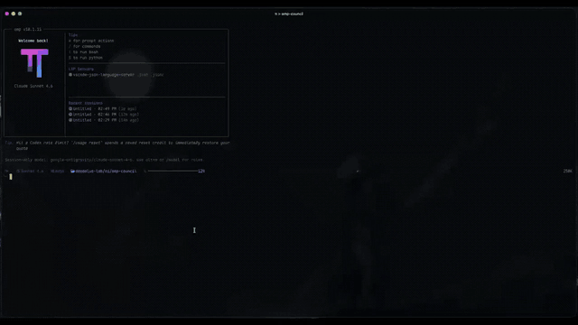

# omp-council

Run several of your OMP models on one question.



`/council` is review. Models answer independently, then optionally debate. The current session model chairs and writes the decision. No majority vote.

`/arena` is competition. Models implement in isolated workspaces. A blind judge sees Candidate A/B/C, not model names. Nothing hits your tree until `/arena apply`.

Any model OMP shows as authenticated can sit. No vendor list.

Needs OMP v18+.

## Install

```text
/marketplace add Shadorain/omp-council
/marketplace install council@omp-council
```

Or:

```bash
git clone https://github.com/Shadorain/omp-council.git ~/.omp/agent/extensions/omp-council
```

Local checkout: `./install.sh` (symlinks into `~/.omp/agent/extensions/omp-council`). `OMP_COUNCIL_COPY=1 ./install.sh` copies instead. Restart OMP after install. `/council config` prints `Loaded from:` so you can see which tree is live. Git pull on that tree, then restart. A copy will not pick up pulls.

## Council

```text
/council
```

First time, pick 2-8 models. That list is `~/.omp/agent/council.json`. `/council setup` rebuilds it.

Then pick seats, Quick / Debate / Deep, a role, and the question. The widget tracks seats. Esc asks before abort. `/council cancel` skips the prompt.

```text
/council --deep --role architecture -- Review this service boundary.
/council -t
/council -t --deep --role architecture -- Review this.
/council default -- Should this API move behind a repository layer?
/council tag:reasoning -- Review this design.
```

Modes: `--quick` independent only. Default `--debate` adds one anonymized rebuttal. `--deep` adds a final round.

Roles: `general`, `architecture`, `debug`, `security`, `refactor`. Roles are not tied to a vendor.

`-t` / `--tmp` picks from every authenticated model for this run only. It does not write `council.json`.

## Arena

```text
/arena
/arena -t --profile rust -- Implement this refactor.
/arena apply
```

Candidates run isolated (`apply: false`, `merge: false`). The judge never sees model names until after scoring. `/arena apply` checks the winning diff (`git apply --check`), asks, then applies.

Default judge is the current session model. `-t` also picks a judge unless you pass `--judge`.

`--profile rust` asks candidates to run, when they can:

```text
cargo fmt --check
cargo check --workspace --all-targets
cargo clippy --workspace --all-targets -- -D warnings
cargo test --workspace
```

`--profile auto` uses rust if there is a root `Cargo.toml`.

## Look back

```text
/council history
/council history C14
/arena history A3
```

Tab after `history` lists run ids with the original prompt.

Picking an id opens an overlay like `/btw`. `b` keeps it in chat. Esc quits and writes nothing.

Last 20 runs live in `~/.omp/agent/council-runs.jsonl` and `arena-runs.jsonl`. Caps are `retainCouncil` / `retainArena` in `council.json`.

## Commands

Shared: `status`, `cancel`, `history`, `clear`, `setup`, `config`, `help`.

`/council cancel` can cancel an Arena, and the other way around. `clear` refuses while a run is live.

`/council test` after setup runs the saved seats with prompt `test`. Unresolved tokens are the question. `--` still forces an explicit prompt.

Picker: type to filter, Space toggles, Enter submits.

## Config

```json
{
  "version": 1,
  "participants": [
    {
      "id": "primary-reasoner",
      "label": "Primary Reasoner",
      "model": "provider-a/model-a",
      "aliases": ["reasoner"],
      "tags": ["reasoning"]
    }
  ],
  "presets": {
    "default": ["primary-reasoner"]
  },
  "retainCouncil": 20,
  "retainArena": 20,
  "shimmer": true
}
```

`model` is any selector OMP already understands, including role aliases. A selector typed on the command line is one-shot unless you also save it.

Turn the widget wave off with `"shimmer": false` or `OMP_COUNCIL_SHIMMER=0`.

```text
PI_CODING_AGENT_DIR   OMP agent directory
OMP_AGENT_DIR         fallback agent directory
OMP_COUNCIL_CONFIG    exact path for council.json
OMP_COUNCIL_SHIMMER   0/false/off disables the header wave
```

## Widget

Chat kickoff is a rule: `─ Council · C10 ─`. The panel above the editor is `Council · C10` / `Arena · A1`. Seat time and cost tick while live. `total` only appears after done, cancelled, or failed.

## Limits

- 2-8 models per run.
- Picker only lists models OMP considers authenticated in this session.
- OMP `eval` `agent()` has no per-call `model` override, so each run writes short-lived agent files under `~/.omp/agent/agents/` and deletes them after. `--tmp` never writes the registry.
- A parent `spawns:` policy can reject those runtime agents. Normal top-level sessions allow them.
- Arena needs `task.isolation.enabled`.
- OMP `retry.fallbackChains.default` still applies to pinned models. A 503 can land on another model. The widget flags `via <model>`.
- Hard crash can leave a stale agent file or Hub jsonl. Next session start, cancel, or `clear` cleans them.

## Develop

```bash
bun install
bun test
bun run typecheck
```
